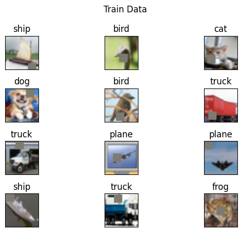
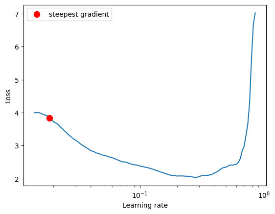
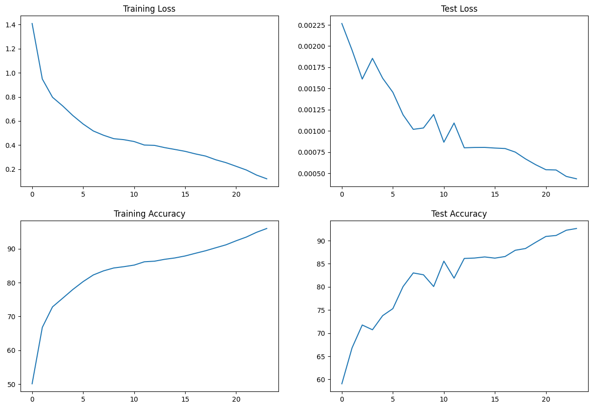
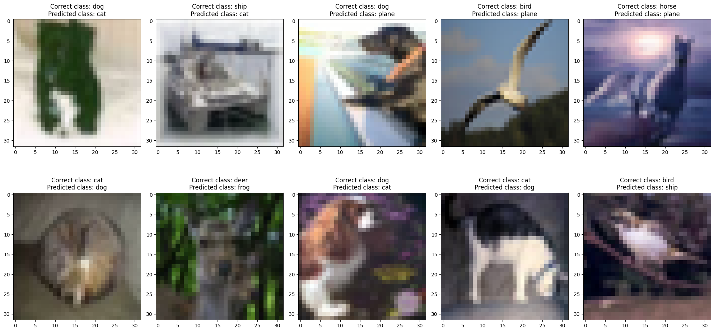

# Session 10

# Residual Connections and One Cycle Policy

[](https://www.python.org/downloads/release/python-380/)
[](https://pytorch.org/docs/stable/index.html)
[](https://pytorch.org/vision/stable/index.html)
[](https://tqdm.github.io/)
[](https://albumentations.ai/docs/)
[](https://pypi.org/project/torch-lr-finder/)

<br>

# Task

Write a customLinks to an external site. ResNet architecture for CIFAR10 that has the following architecture:
1. PrepLayer - Conv 3x3 (s1, p1) >> BN >> RELU [64k]
2. Layer1 -
   - X = Conv 3x3 (s1, p1) >> MaxPool2D >> BN >> RELU [128k]   
   - R1 = ResBlock( (Conv-BN-ReLU-Conv-BN-ReLU))(X) [128k] 
   - Add(X, R1)
3. Layer 2 -
   - Conv 3x3 [256k]
   - MaxPooling2D
   - BN
   - ReLU
4. Layer 3 -
   - X = Conv 3x3 (s1, p1) >> MaxPool2D >> BN >> RELU [512k]
   - R2 = ResBlock( (Conv-BN-ReLU-Conv-BN-ReLU))(X) [512k]
   - Add(X, R2)
5. MaxPooling with Kernel Size 4
6. FC Layer 
7. SoftMax

- Uses One Cycle Policy such that:
   1. Total Epochs = 24
   2. Max at Epoch = 5
   3. LRMIN = FIND
   4. LRMAX = FIND
   5. NO Annihilation

- Uses this transform :
RandomCrop 32, 32 (after padding of 4) >> FlipLR >> Followed by CutOut(8, 8)
- Batch size = 512
- Use ADAM, and CrossEntropyLoss
- Target Accuracy: 90%

<br>

# Solution

This repository contains a Pytorch model trained and validated on `CIFAR-10` dataset. The scheduler used is `OneCycleLR`, which gave us `92.63` Validation accuracy.

<br>

## File Contents

1. `model.py` - This file contains a model created by using the above conditions.

2. `utils.py` - This file contains all the necessary utility functions and methods.

3. `backprop.py` - This file contains necessary train and test functions for the model as well as plotting graphs, misclassified images and each class accuracy function.

4. `dataset.py` - This file contains data loaders and data augmentation methods (train_transforms and test_transforms).

<br>

# Applying Albumentations library

We have used [Albumentations](https://albumentations.ai/docs/) library for Data Augmentation in this assignment.

### Features :
- Albumentations is a fast and flexible image augmentation library.
- Albumentations is written in Python, and it is licensed under the MIT license. 

<br>

```python
class Album_Train_transform():

    def __init__(self):
        self.albumentations_transform = A.Compose([
            A.Normalize(mean=[0.4914, 0.4822, 0.4471],std=[0.2469, 0.2433, 0.2615], always_apply=True),
            A.PadIfNeeded(min_height=36, min_width=36, always_apply=True),
            A.RandomCrop(height=32, width=32, always_apply=True),
            A.HorizontalFlip(),
            A.Cutout(num_holes=1, max_h_size=8, max_w_size=8, fill_value=0, p=1.0),
            ToTensorV2(),
        ])

    def __call__(self, img):
        img = np.array(img)
        img = self.albumentations_transform(image=img)['image']
        return img 
```



<br>

# Model Summary

```python
----------------------------------------------------------------
        Layer (type)               Output Shape         Param #
================================================================
            Conv2d-1           [-1, 64, 32, 32]           1,728
       BatchNorm2d-2           [-1, 64, 32, 32]             128
              ReLU-3           [-1, 64, 32, 32]               0
           Dropout-4           [-1, 64, 32, 32]               0
         ConvLayer-5           [-1, 64, 32, 32]               0
      Custom_Layer-6           [-1, 64, 32, 32]               0
            Conv2d-7          [-1, 128, 32, 32]          73,728
         MaxPool2d-8          [-1, 128, 16, 16]               0
       BatchNorm2d-9          [-1, 128, 16, 16]             256
             ReLU-10          [-1, 128, 16, 16]               0
          Dropout-11          [-1, 128, 16, 16]               0
        ConvLayer-12          [-1, 128, 16, 16]               0
           Conv2d-13          [-1, 128, 16, 16]         147,456
      BatchNorm2d-14          [-1, 128, 16, 16]             256
             ReLU-15          [-1, 128, 16, 16]               0
          Dropout-16          [-1, 128, 16, 16]               0
        ConvLayer-17          [-1, 128, 16, 16]               0
           Conv2d-18          [-1, 128, 16, 16]         147,456
      BatchNorm2d-19          [-1, 128, 16, 16]             256
             ReLU-20          [-1, 128, 16, 16]               0
          Dropout-21          [-1, 128, 16, 16]               0
        ConvLayer-22          [-1, 128, 16, 16]               0
     Custom_Layer-23          [-1, 128, 16, 16]               0
           Conv2d-24          [-1, 256, 16, 16]         294,912
        MaxPool2d-25            [-1, 256, 8, 8]               0
      BatchNorm2d-26            [-1, 256, 8, 8]             512
             ReLU-27            [-1, 256, 8, 8]               0
          Dropout-28            [-1, 256, 8, 8]               0
        ConvLayer-29            [-1, 256, 8, 8]               0
     Custom_Layer-30            [-1, 256, 8, 8]               0
           Conv2d-31            [-1, 512, 8, 8]       1,179,648
        MaxPool2d-32            [-1, 512, 4, 4]               0
      BatchNorm2d-33            [-1, 512, 4, 4]           1,024
             ReLU-34            [-1, 512, 4, 4]               0
          Dropout-35            [-1, 512, 4, 4]               0
        ConvLayer-36            [-1, 512, 4, 4]               0
           Conv2d-37            [-1, 512, 4, 4]       2,359,296
      BatchNorm2d-38            [-1, 512, 4, 4]           1,024
             ReLU-39            [-1, 512, 4, 4]               0
          Dropout-40            [-1, 512, 4, 4]               0
        ConvLayer-41            [-1, 512, 4, 4]               0
           Conv2d-42            [-1, 512, 4, 4]       2,359,296
      BatchNorm2d-43            [-1, 512, 4, 4]           1,024
             ReLU-44            [-1, 512, 4, 4]               0
          Dropout-45            [-1, 512, 4, 4]               0
        ConvLayer-46            [-1, 512, 4, 4]               0
     Custom_Layer-47            [-1, 512, 4, 4]               0
        MaxPool2d-48            [-1, 512, 1, 1]               0
          Flatten-49                  [-1, 512]               0
           Linear-50                   [-1, 10]           5,130
================================================================
Total params: 6,573,130
Trainable params: 6,573,130
Non-trainable params: 0
----------------------------------------------------------------
Input size (MB): 0.01
Forward/backward pass size (MB): 10.51
Params size (MB): 25.07
Estimated Total Size (MB): 35.59
----------------------------------------------------------------
```

<br>

# Finding Optimal LR

- LRFinder determines an optimal learning rate for training a neural network. 
- The LRFinder algorithm works by gradually increasing the learning rate over a defined range while monitoring the corresponding loss or some other metric of interest. 
- Initially, the learning rate is set to a very small value. 
- Then, during each training iteration, the learning rate is exponentially increased until it reaches a specified maximum value.

```python
LR suggestion: steepest gradient
Suggested LR: 1.87E-02
```



<br>

# Results

Best Training Accuracy : `95.96`       
Best Test Accuracy : `92.63`     



<br>

# Misclassified Images



<br>

# Accuracy of each class

```python
Accuracy for class: plane is 94.0 %
Accuracy for class: car   is 96.7 %
Accuracy for class: bird  is 89.5 %
Accuracy for class: cat   is 83.6 %
Accuracy for class: deer  is 93.5 %
Accuracy for class: dog   is 90.2 %
Accuracy for class: frog  is 94.4 %
Accuracy for class: horse is 94.1 %
Accuracy for class: ship  is 94.7 %
Accuracy for class: truck is 95.6 %
```

<br>

# Training Testing Logs

```python
Epoch 1
Train: Loss=1.0395 Batch_id=97 Accuracy=50.14: 100%|██████████| 98/98 [00:33<00:00,  2.90it/s]
Test set: Average loss: 0.0023, Accuracy: 5905/10000 (59.05%)

Epoch 2
Train: Loss=0.9464 Batch_id=97 Accuracy=66.77: 100%|██████████| 98/98 [00:30<00:00,  3.23it/s]
Test set: Average loss: 0.0020, Accuracy: 6681/10000 (66.81%)

Epoch 3
Train: Loss=0.7578 Batch_id=97 Accuracy=72.83: 100%|██████████| 98/98 [00:31<00:00,  3.15it/s]
Test set: Average loss: 0.0016, Accuracy: 7176/10000 (71.76%)

Epoch 4
Train: Loss=0.5996 Batch_id=97 Accuracy=75.39: 100%|██████████| 98/98 [00:29<00:00,  3.28it/s]
Test set: Average loss: 0.0019, Accuracy: 7073/10000 (70.73%)

Epoch 5
Train: Loss=0.6691 Batch_id=97 Accuracy=77.98: 100%|██████████| 98/98 [00:30<00:00,  3.24it/s]
Test set: Average loss: 0.0016, Accuracy: 7378/10000 (73.78%)

Epoch 6
Train: Loss=0.5478 Batch_id=97 Accuracy=80.29: 100%|██████████| 98/98 [00:30<00:00,  3.24it/s]
Test set: Average loss: 0.0015, Accuracy: 7530/10000 (75.30%)

Epoch 7
Train: Loss=0.4722 Batch_id=97 Accuracy=82.25: 100%|██████████| 98/98 [00:30<00:00,  3.23it/s]
Test set: Average loss: 0.0012, Accuracy: 8007/10000 (80.07%)

Epoch 8
Train: Loss=0.5154 Batch_id=97 Accuracy=83.46: 100%|██████████| 98/98 [00:31<00:00,  3.16it/s]
Test set: Average loss: 0.0010, Accuracy: 8302/10000 (83.02%)

Epoch 9
Train: Loss=0.4450 Batch_id=97 Accuracy=84.31: 100%|██████████| 98/98 [00:29<00:00,  3.29it/s]
Test set: Average loss: 0.0010, Accuracy: 8262/10000 (82.62%)

Epoch 10
Train: Loss=0.4674 Batch_id=97 Accuracy=84.69: 100%|██████████| 98/98 [00:30<00:00,  3.25it/s]
Test set: Average loss: 0.0012, Accuracy: 8008/10000 (80.08%)

Epoch 11
Train: Loss=0.4314 Batch_id=97 Accuracy=85.16: 100%|██████████| 98/98 [00:30<00:00,  3.18it/s]
Test set: Average loss: 0.0009, Accuracy: 8557/10000 (85.57%)

Epoch 12
Train: Loss=0.3759 Batch_id=97 Accuracy=86.14: 100%|██████████| 98/98 [00:29<00:00,  3.27it/s]
Test set: Average loss: 0.0011, Accuracy: 8189/10000 (81.89%)

Epoch 13
Train: Loss=0.5019 Batch_id=97 Accuracy=86.31: 100%|██████████| 98/98 [00:30<00:00,  3.18it/s]
Test set: Average loss: 0.0008, Accuracy: 8615/10000 (86.15%)

Epoch 14
Train: Loss=0.3556 Batch_id=97 Accuracy=86.87: 100%|██████████| 98/98 [00:30<00:00,  3.25it/s]
Test set: Average loss: 0.0008, Accuracy: 8624/10000 (86.24%)

Epoch 15
Train: Loss=0.3481 Batch_id=97 Accuracy=87.27: 100%|██████████| 98/98 [00:29<00:00,  3.28it/s]
Test set: Average loss: 0.0008, Accuracy: 8648/10000 (86.48%)

Epoch 16
Train: Loss=0.3878 Batch_id=97 Accuracy=87.86: 100%|██████████| 98/98 [00:30<00:00,  3.22it/s]
Test set: Average loss: 0.0008, Accuracy: 8622/10000 (86.22%)

Epoch 17
Train: Loss=0.3198 Batch_id=97 Accuracy=88.64: 100%|██████████| 98/98 [00:29<00:00,  3.28it/s]
Test set: Average loss: 0.0008, Accuracy: 8657/10000 (86.57%)

Epoch 18
Train: Loss=0.3127 Batch_id=97 Accuracy=89.39: 100%|██████████| 98/98 [00:30<00:00,  3.18it/s]
Test set: Average loss: 0.0008, Accuracy: 8792/10000 (87.92%)

Epoch 19
Train: Loss=0.2589 Batch_id=97 Accuracy=90.27: 100%|██████████| 98/98 [00:29<00:00,  3.28it/s]
Test set: Average loss: 0.0007, Accuracy: 8830/10000 (88.30%)

Epoch 20
Train: Loss=0.2757 Batch_id=97 Accuracy=91.14: 100%|██████████| 98/98 [00:30<00:00,  3.20it/s]
Test set: Average loss: 0.0006, Accuracy: 8964/10000 (89.64%)

Epoch 21
Train: Loss=0.2604 Batch_id=97 Accuracy=92.34: 100%|██████████| 98/98 [00:30<00:00,  3.20it/s]
Test set: Average loss: 0.0005, Accuracy: 9091/10000 (90.91%)

Epoch 22
Train: Loss=0.2023 Batch_id=97 Accuracy=93.44: 100%|██████████| 98/98 [00:29<00:00,  3.29it/s]
Test set: Average loss: 0.0005, Accuracy: 9112/10000 (91.12%)

Epoch 23
Train: Loss=0.1469 Batch_id=97 Accuracy=94.83: 100%|██████████| 98/98 [00:30<00:00,  3.20it/s]
Test set: Average loss: 0.0005, Accuracy: 9225/10000 (92.25%)

Epoch 24
Train: Loss=0.1017 Batch_id=97 Accuracy=95.96: 100%|██████████| 98/98 [00:29<00:00,  3.28it/s]
Test set: Average loss: 0.0004, Accuracy: 9263/10000 (92.63%)
```