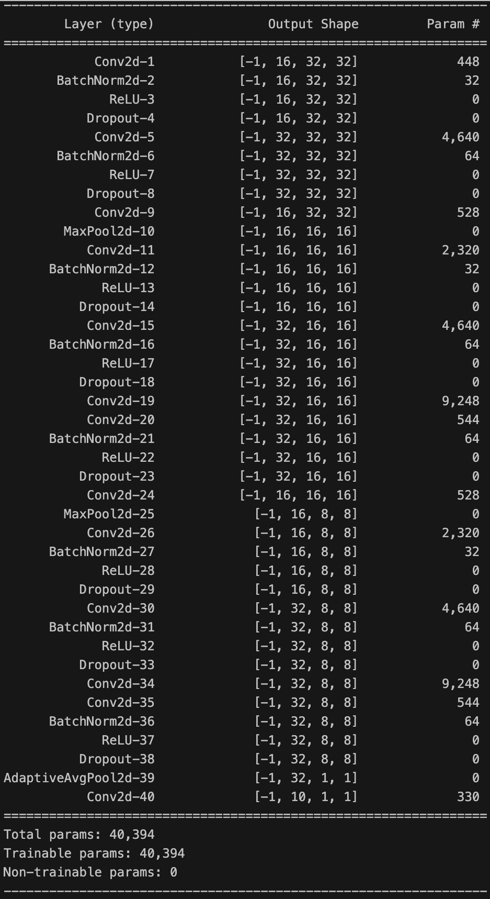
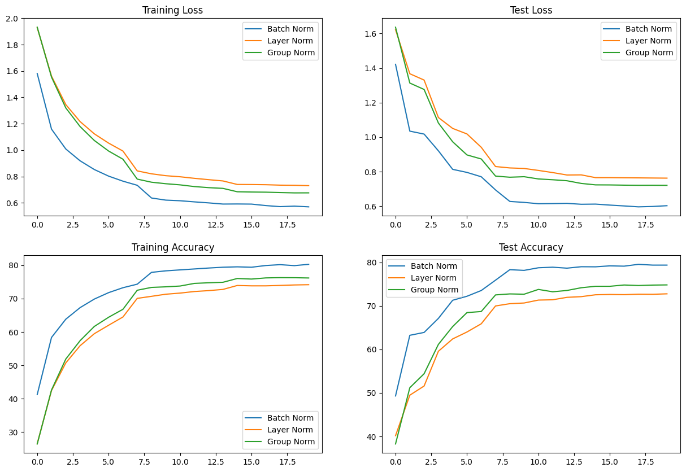
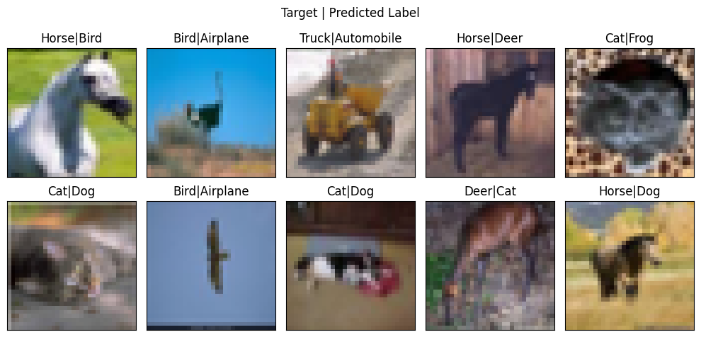
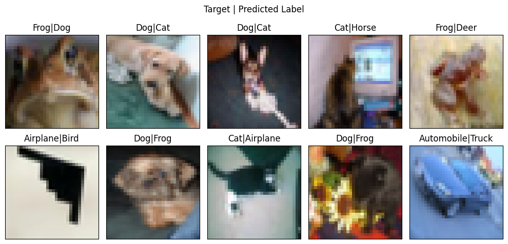
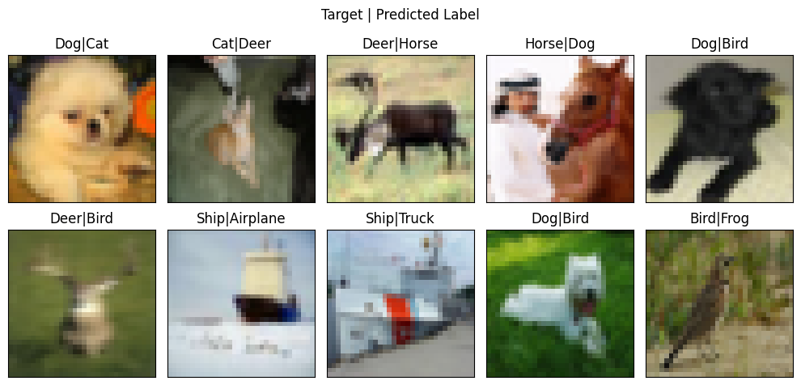

# Session 8

## Introduction

This assignment compares different normalization techniques: **Batch Norm, Layer Norm** and **Group Norm**.

We are presented with a multiclass classification problem on the CIFAR10 dataset.

### Target
1. Accuracy > 70%
2. Number of Parameters < 50k
3. Epochs <= 20

Use of Residual Connection is also advised.

## Implementation

The above structure with two residual connections is used.

## Normalization Technique Comparison
_Note: We use GN with num_groups = 4_

### Metrics
|    | Train Acc | Test Acc | Train Loss | Test Loss |
|----|-----------|----------|------------|-----------|
| BN | 80.27     | 79.39    | 0.57       | 0.60      |
| GN | 76.18     | 74.84    | 0.68       | 0.72      |
| LN | 74.17     | 72.79    | 0.73       | 0.76      |

## Performance Curves

We see that the graphs portray BN > GN (4 groups) > LN consistently in all the training continues. We explore the reason for this in the next sections.

## Confusion Matrices

**Batch Norm | Group Norm | Layer Norm**

    
    
    

## Misclassified Images
**Batch Norm**

Total Incorrect Preds = 2061

**Group Norm**

Total Incorrect Preds = 2516

**Layer Norm**

Total Incorrect Preds = 3139

We see that the misclassified images in all three models have classes very close to each other as misclassified. These misclassified images would be hard for a human to classify correctly too!

 

# Analysis
## Batch normalization
- Highest training and testing accuracy as it normalizes across the whole mini-batch per channel.

## Group normalization
- It performed worse than Batch Normalization and better than Layer Normalization.
- As the number of groups increases, it provides better results.

## Layer normalization
- It performed the worst as it normalizes each image across all channels.
- This is not suitable for image classifiers.

 